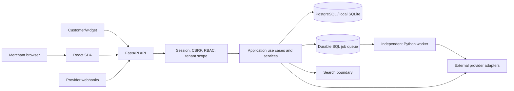

# Product and System Overview

## Product problem

Small and mid-sized merchants often operate catalog data, social publishing, customer chats,
orders, retention activity, and analytics in disconnected tools. The product creates one
operational workspace in which every recommendation and external action is tied back to
authoritative store data, permissions, consent, approvals, and an audit record.

## Primary actors

| Actor             | Responsibilities                                                                           |
| ----------------- | ------------------------------------------------------------------------------------------ |
| Store owner       | Organization ownership, team control, billing state, deletion, and final access decisions. |
| Admin             | Store settings, channels, API keys, integrations, and operational configuration.           |
| Marketer          | Brand profile, content generation, campaigns, approvals, scheduling, and publishing.       |
| Agent             | Inbox conversations, replies, customer support, order creation, and opportunity execution. |
| Analyst           | Read-oriented access to customers, analytics, products, and operating outcomes.            |
| Customer          | Uses website chat or connected messaging channels and may create an order.                 |
| Platform operator | Cross-store health, alerts, jobs, audit review, store suspension, and diagnostics.         |
| Background worker | Claims durable jobs and performs delayed or external side effects.                         |

Roles are enforced on the server. A browser-supplied role or store identifier is never an
authorization source.

## Capability groups

- Identity: registration, email verification, login, logout, progressive login delay,
  password reset, session management, MFA, invitations, store switching, and RBAC.
- Commerce: products, variants, catalog synchronization, source-of-truth rules, SKU metadata,
  inventory ledger, orders, independent payment and fulfillment states, COD, cancellation,
  refund contracts, and immutable transitions.
- Customer operations: unified identities, consent, inbox conversations, messages, notes,
  assignment, priority, status, customer merge, RFM, lead evidence, preferences, and timeline.
- Revenue operations: explainable opportunities, expected value, priority, approval,
  execution, attribution, and conversion reporting.
- Marketing: brand profile, content generation, versions, campaigns, approval hashes,
  scheduling, Facebook/Instagram publishing adapters, and partial-result handling.
- Automation: triggers, conditions, delays, approval gates, deduplication, retries, run
  history, and controlled actions.
- Platform: API keys, website widget, public catalog, public events, quotas, subscriptions,
  analytics, audit, privacy exports/deletions, retention, health, and operator tooling.

## Topology



There are two application processes in production: the request-serving web process and the
persistent worker. The web process does not use incoming requests as a scheduler. A signed
recovery endpoint can requeue abandoned leases, but it is not a replacement for a worker.

## Architectural style

The project is a modular monolith rather than microservices. It keeps transactional operations
inside one deployable backend while separating responsibilities by code boundary:

```text
HTTP/UI -> API contracts -> application orchestration -> domain rules
                                         |              |
                                         v              v
                                  repositories      provider ports
                                         |              |
                                         v              v
                                  authoritative SQL  external adapters
```

This avoids distributed transactions and internal network failure while preserving seams that
can later become services if scale or team ownership justifies it.

## Dependency rules

- `app/domain` contains contracts, enums, errors, filtering, ranking, and validation. It should
  not depend on FastAPI, SQLAlchemy, provider SDKs, or browser concepts.
- `app/application` coordinates end-to-end use cases.
- `app/services` implements reusable tenant-scoped business operations and job handlers.
- `app/repositories` translates authoritative SQL state into domain objects.
- `app/integrations` implements replaceable external-provider and storage boundaries.
- `app/api` owns HTTP parsing, authentication dependencies, response contracts, and error
  mapping.
- `app/container.py` is the composition root that selects deterministic, live, or disabled
  implementations from validated settings.
- `web/src` is one SPA and does not contain a second business backend.

## Sources of truth

| Fact                            | Authority                                                    |
| ------------------------------- | ------------------------------------------------------------ |
| Price, stock, product lifecycle | SQL catalog and inventory ledger                             |
| Order, payment, fulfillment     | SQL order state and signed payment webhook events            |
| Tenant access and role          | Membership and revocable session records                     |
| Customer consent                | Store- and channel-scoped consent records                    |
| Content approval                | Actor, timestamp, content version, and SHA-256 approval hash |
| Provider event completion       | Persisted webhook/event deduplication and durable job state  |
| AI recommendation facts         | Reloaded SQL catalog/policy records, never vector text alone |
| Entitlements and quotas         | Server-side plan/subscription and usage records              |

Redirect pages do not declare a payment successful. AI cannot change prices, stock, consent,
approval, or payment facts. Imported provider products retain provider source-of-truth metadata,
and unsupported local authority changes are rejected.

## Architectural decisions

The decision records in `docs/adr/` establish five important constraints:

1. Use a modular monolith for the validated scope.
2. Do not place an LLM supervisor in charge of routing or critical business state.
3. Treat the database, not a vector index or model response, as the source of truth.
4. Use publicly reachable managed image URLs when real Meta publishing requires them.
5. Require a stored human approval before publishing content.

## Runtime modes

| Mode                    | Purpose                      | Important behavior                                                                                                                 |
| ----------------------- | ---------------------------- | ---------------------------------------------------------------------------------------------------------------------------------- |
| Local deterministic     | Development, tests, LMS demo | SQLite and deterministic AI/provider fakes may be enabled explicitly. No real external effect is implied.                          |
| Production configured   | Real deployment              | PostgreSQL/TLS, secure cookies, strong secrets, live adapters, external worker, monitoring, and provider credentials are required. |
| Production unconfigured | Safety state                 | Missing AI, payment, publishing, scanner, or email providers fail closed instead of silently using demos.                          |

## Quality attributes

- Security: tenant isolation, server RBAC, CSRF, encrypted credentials, signed webhooks,
  scoped API keys, rate limits, approval gates, and secret scanning.
- Reliability: durable jobs, leases, idempotency, retry/backoff, dead-letter state, health
  endpoints, diagnostics, and audit logs.
- Maintainability: typed boundaries, layer separation, model grouping, migration history,
  lazy frontend routes, shared UI primitives, and automated formatting/linting.
- Accessibility: semantic markup, keyboard focus, responsive layouts, locale direction,
  reduced motion/transparency, and WCAG checks.
- Observability: request IDs, structured redacted logs, AI usage metrics, provider health,
  operator alerts, Sentry boundary, and readiness endpoints.
