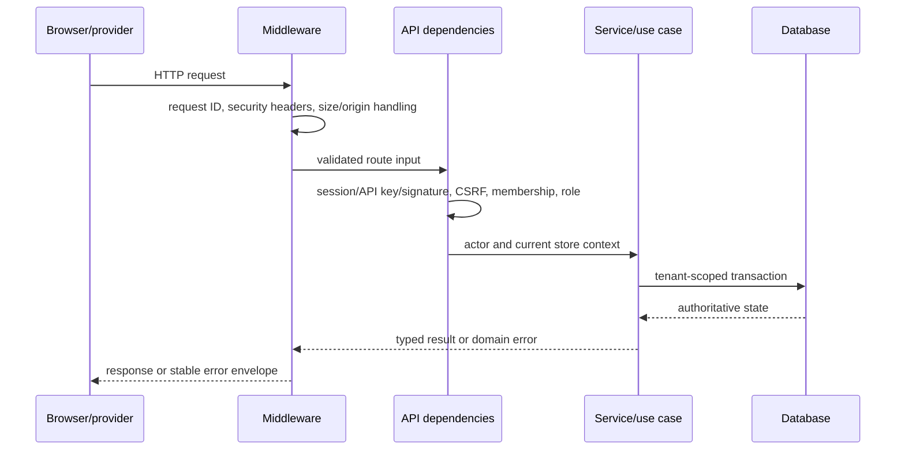

# Backend Engineering

## Stack

| Concern             | Technology                                                              |
| ------------------- | ----------------------------------------------------------------------- |
| Web framework       | FastAPI 0.139.2 / Starlette                                             |
| Runtime             | Python 3.11–3.13 supported by the project; local verification used 3.13 |
| Contracts/config    | Pydantic 2 and pydantic-settings                                        |
| Persistence         | SQLAlchemy 2 ORM                                                        |
| Production database | PostgreSQL through psycopg 3                                            |
| Local database      | SQLite for an isolated non-production demo                              |
| Migrations          | Alembic 1.18; 28 ordered migrations                                     |
| HTTP providers      | HTTPX                                                                   |
| AI adapter          | langchain-openai behind a local protocol                                |
| Encryption          | Cryptography/Fernet-derived credential vault                            |
| Observability       | structured logging and optional Sentry FastAPI integration              |
| Packaging           | Hatchling with locked `uv.lock`                                         |

`app/main.py` is the application factory and `app/container.py` is the composition root. The
Vercel compatibility entry is `api/index.py`, while Docker starts the same FastAPI application.

## Request lifecycle



FastAPI enables OpenAPI, Swagger, and ReDoc outside production. CORS is credential-aware and
uses configured origins, an explicit method set, and only required headers. The app serves the
compiled SPA when present, plus controlled media and widget endpoints.

## Layer responsibilities

### API layer — `app/api`

- `routes/` contains 30 route modules grouped by capability.
- `dependencies.py` resolves database sessions, current user/store/membership, RBAC, CSRF,
  API keys, operator identity, and container services.
- `schemas.py` contains HTTP-specific response wrappers.
- `error_handlers.py` converts domain exceptions into a stable JSON error contract.
- `request_body.py` reads bounded request bodies and supports webhook streaming rejection.

Routes should validate and delegate; durable business transitions belong in application or
service code.

### Application layer — `app/application`

The explicit use cases are:

- `OnboardProductUseCase`: validate image, store it, analyze it, persist a draft, and index it.
- `ProductManagementUseCase`: review and activate products while synchronizing search state.
- `GenerateMarketingPackUseCase`: generate platform-specific copy from reviewed facts.
- `MarketingLifecycleUseCase`: edit, validate, approve, hash, publish idempotently, and audit.
- `AssistCustomerUseCase`: extract need, retrieve candidates, reload SQL truth, rank, ground,
  validate, and save the query.

Larger operational domains such as orders, automations, WhatsApp, opportunities, privacy, and
content studio use tenant-scoped functions and job handlers under `app/services`.

### Domain layer — `app/domain`

The domain has grouped Pydantic contracts for identity, catalog, marketing, messaging,
intelligence, orders, automations, integrations, operations, public APIs, and sales. It also
defines business enums, typed domain errors, deterministic ranking, image/content validation,
approval hashing, and grounded-response validation.

Domain errors include invalid input, authentication, MFA required, account delay/lock state,
email verification, authorization, not found, conflict, approval required, rate limiting,
quota exceeded, integration unavailable, external-provider failure, and grounding failure.

### Service layer — `app/services`

Major services cover AI usage, analytics, API keys, auth lifecycle, automations, billing,
commerce synchronization, content studio, conversations, encrypted credentials, customer
intelligence, inventory, jobs, marketing, Meta channels/publishing, opportunities, orders,
privacy, product intelligence, provider connections, rate limits, retrieval/search, store
settings, team membership, and WhatsApp.

### Repository layer — `app/repositories`

Repositories centralize tenant-aware persistence for audit, content, dashboard, inbox, policies,
products, provider connections/OAuth, publications, sales queries, and tenant membership. This
keeps SQLAlchemy details out of domain validation and lets tests substitute controlled stores.

### Integration layer — `app/integrations`

External boundaries implement AI, billing, messaging channels, search, email, Facebook,
Instagram, image storage, malware scanning, Meta APIs, payments, Stripe, WhatsApp, Shopify,
WooCommerce, and generic commerce connections. Most ports provide real, deterministic/demo, and
disabled implementations. Production chooses disabled rather than demo when configuration is
missing.

## Persistence and transactions

`app/db/session.py` creates the engine and session factory. Repositories and services work inside
SQLAlchemy sessions. PostgreSQL is required for production and migration release gates; SQLite
is restricted to safe local initialization.

The 28 Alembic migrations evolve the system from the initial catalog into tenancy, background
jobs, conversations, API keys/events, channels, orders, customer intelligence, opportunities,
automations, content, AI usage, billing, production hardening, media, deduplication, provider
connections, full auth lifecycle, publishable keys, commerce connectors, Stripe payments, job
leases, privacy operations, AI measurement, and final catalog/inventory/order refinements.

Application builds never run migrations or seed production data. Migrations are an explicit
release operation.

## Durable jobs

`BackgroundJobModel` stores job type, payload, deduplication key, availability time, attempt
state, lease ownership/expiry, errors, and completion state. `JobQueue` enqueues work and
`JobWorker` claims leases, dispatches registered handlers, retries transient failures with
backoff, and moves exhausted work to a dead-letter state.

Registered job families include:

- `channel.send_message`
- `opportunities.scan`
- `content.generate_automation`
- `content.publish`
- `commerce.sync`
- `automation.execute`
- `privacy.delete`
- `privacy.retention`
- `orders.review_request`
- `orders.repurchase_suggestion`

The independent process starts through `python -m scripts.worker`. Internal signed operations
support stale-lease recovery and diagnostics without turning arbitrary requests into workers.

## Configuration

`app/config.py` validates environment-derived settings. Categories include:

- Environment, database, CORS, serverless behavior, public URL, and upload/search paths.
- Demo identity and deterministic mode.
- AI provider/model/base URL, request credentials, timeout, pricing, and circuit breaker.
- Image storage, Cloudinary, malware scanner, and upload size limits.
- Meta, Instagram, Facebook, WhatsApp, Shopify, and commerce connector settings.
- Free-access policy, Stripe billing/payment, COD, Resend email, and webhook secrets.
- Encryption key rotation, worker leases/polling, cron/release credentials, operators,
  cookies/session TTL, Sentry, and release SHA.

`.env.example` is the key-name template. `.env` is local-only, ignored, excluded from release
bundles, and must never be placed in the LMS ZIP.

## Error contract

Business and integration failures use one envelope:

```text
error.code       stable machine-readable identifier
error.message    safe user-facing explanation
error.details    structured non-secret context
error.request_id correlation identifier
```

Typical statuses are 400 invalid input, 401 unauthenticated, 403 CSRF/role failure, 404 missing
tenant resource, 409 invalid lifecycle transition, 422 contract validation, 429 throttled, 402
quota exceeded, 502 provider failure, and 503 provider unavailable.

## Deployment shape

- Local: Vite dev server, Uvicorn API, SQLite, and optional worker.
- Docker: FastAPI serves the compiled SPA; the worker is a separate command/process.
- Serverless/Vercel: the React bundle and FastAPI entry can be deployed together, but timely
  durable work still needs an approved persistent worker or sufficiently frequent external
  scheduler.
- Production: PostgreSQL with TLS, explicit migrations, secure cookies, restricted origins,
  real provider credentials, external monitoring, backups, and smoke tests.
