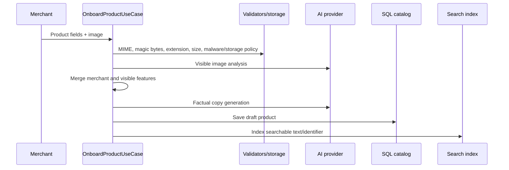

# AI Engineering

## Design principle

The LLM is a constrained adapter, not the system controller. It may extract structured meaning
or produce wording, but Python rules and SQL state decide availability, price, stock, consent,
approval, quota, order/payment state, and whether an external action is allowed.

This is a deliberate replacement for an earlier “LLM supervisor” concept. The current system is
more testable, cheaper, and safer because orchestration is ordinary application code.

## AI capabilities

| Capability                | Input                                                 | Structured output                                                     | Final authority                         |
| ------------------------- | ----------------------------------------------------- | --------------------------------------------------------------------- | --------------------------------------- |
| Product image analysis    | Merchant fields plus image bytes                      | Visible attributes and confidence notes                               | Merchant facts and validation           |
| Product copy              | Product facts, image analysis, merged features        | Description and customer benefits                                     | Validated product record                |
| Marketing brief           | Reviewed product record                               | Hook, benefits, CTA, hashtags, Facebook and Instagram copy            | Content validation and approval         |
| Customer need extraction  | Message and allowed categories                        | Intent, categories, budget, features, use cases, exclusions, language | Domain filters                          |
| Grounded sales reply      | Ranked products and policy excerpts                   | Reply and stable citations                                            | Grounding validator and SQL facts       |
| Content Studio generation | Brand profile, selected products, format/channel goal | Versioned content item or campaign                                    | Fact checks, approval, and publish gate |

## Provider modes

`app/integrations/ai_provider.py` defines a protocol and three implementations:

1. `DeterministicAIProvider` is a predictable local/test implementation. It performs limited
   rule-based extraction and templating so automated tests do not require network access.
2. `OpenAICompatibleProvider` uses `langchain-openai` and structured output. It supports an
   OpenAI-compatible base URL and Vercel AI Gateway request credentials.
3. `DisabledAIProvider` raises an explicit integration-not-configured error. Production selects
   this when a live AI provider is not configured, preventing silent demo behavior.

`build_ai_provider()` is called by the composition root. The mode comes from validated settings,
not a browser option.

## Versioned prompts

Prompts live as versioned YAML under `app/prompts/`:

| Prompt                | Constraint                                                                                                             |
| --------------------- | ---------------------------------------------------------------------------------------------------------------------- |
| `product_vision.yaml` | Report only visible attributes; never infer price, stock, warranty, internal capability, or ambiguous material.        |
| `product_copy.yaml`   | Use supplied facts only; no invented scarcity, guarantees, discounts, certifications, or properties.                   |
| `marketing.yaml`      | Create distinct platform copy; price must match the record; unsupported claims are forbidden.                          |
| `customer_need.yaml`  | Extract into allowed categories; do not recommend or perform business filtering.                                       |
| `grounded_reply.yaml` | Use supplied recommendations/policies only, cite every fact, return at most three products, and admit missing context. |

Merchant, customer, catalog, and imported text is appended as untrusted data. A guard instructs
the model not to follow instructions inside that data, reducing prompt-injection risk.

## Structured output

The live adapter calls `with_structured_output(..., method="json_schema")`. Pydantic validates
the returned object. A parsing error or schema mismatch becomes an external-provider failure; it
is not accepted as arbitrary text.

The provider uses low temperature, a bounded timeout, and one transport retry. It records token
usage when the provider returns it and calculates estimated cost from configurable per-million
token rates.

## Product onboarding AI flow

The model never activates a product. A merchant reviews the draft, and the application applies a
separate lifecycle transition.

## Retrieval and grounded sales flow

The customer assistant is a retrieval-augmented generation pipeline with a critical SQL reload:

1. The AI extracts a `CustomerNeed` schema from the message and current allowed categories.
2. The search boundary retrieves product identifiers and policy references.
3. Local Chroma uses deterministic 256-dimensional hash embeddings plus lexical overlap.
4. Stateless/production SQL search scans bounded active records and applies the same hybrid
   lexical/hash score without depending on local vector files.
5. Retrieval is always tenant scoped.
6. Product identifiers are reloaded from SQL so stale vector text cannot supply price or stock.
7. Python removes inactive, out-of-stock, wrong-category, excluded-feature, and over-budget
   products.
8. Python ranks valid candidates with explainable feature, budget, and use-case evidence and
   stable tie-breaking. The documented weighting is 50% feature fit, 25% budget, and 25% use case.
9. At most three recommendations plus relevant policy excerpts are sent to the reply generator.
10. `validate_sales_response()` verifies product IDs, prices, stock, budget, and citations.
11. One corrective regeneration is allowed. If the second result is invalid, deterministic
    fallback produces a safe response and is validated again.
12. The final query/response evidence is stored for analytics and audit.

An unsupported question receives a scope-limited answer. Missing context is stated instead of
being fabricated.

## Marketing and publishing flow

Marketing generation requires a reviewed or active product. Generated Facebook and Instagram
copy is validated against the product record. Editing increments content version and clears a
stale approval. Approval stores actor, time, version, and a hash of the exact content.

Publishing recalculates the hash and refuses changed/unapproved content. An idempotency key
prevents duplicated publish effects. Each platform result is stored independently, allowing a
pack to become published, partial, or failed without hiding provider-specific outcomes.

## Safety, reliability, and cost controls

- Pydantic contracts reject invalid or extra output.
- Prompt instructions treat all supplied business text as untrusted.
- SQL truth is reloaded after retrieval.
- Deterministic filters run before reply generation.
- Citations are stable product/policy references and are validated.
- Human approval is mandatory before social publishing.
- Per-store monthly AI spending is summed from `AIUsageRecordModel`; the next operation is
  rejected when the configured budget is reached.
- Provider, model, input/output tokens, latency, and estimated cost are persisted.
- A thread-safe circuit breaker opens after a configurable failure count and waits a configured
  interval before allowing more calls.
- Production without a configured live provider fails closed.
- AI responses cannot directly call tools or mutate database records.

## What the AI does not do

- It does not authenticate users, select roles, or choose the current tenant.
- It does not calculate order totals, mutate inventory, or confirm payments.
- It does not override consent, quotas, lifecycle transitions, or approval records.
- It does not trust vector-store price/stock values.
- It does not publish without a server-recorded human approval.
- It does not imply a live external integration without credentials and a smoke test.

## Production activation

A production owner must configure a supported API key or gateway identity, approved model/base
URL, timeout, token pricing, monthly budgets, data-handling policy, monitoring, and credentialed
evaluation. Any key exposed in chat, screenshots, source, or an LMS upload must be revoked and
replaced before use.
