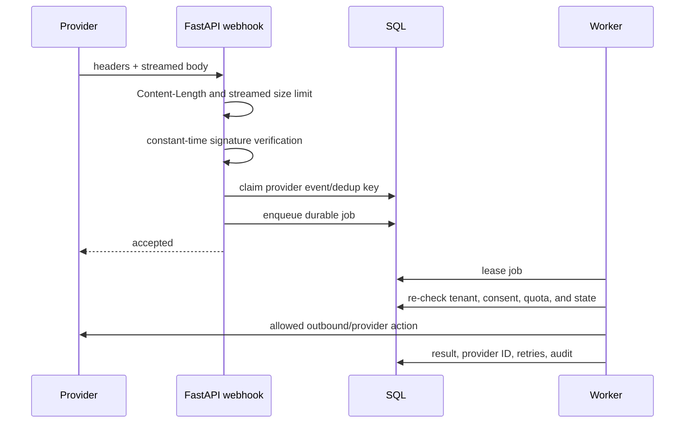

# Data, Integrations, and Workflows

## Data architecture

Production uses PostgreSQL as the authoritative transactional store. Local development can use
SQLite after `scripts.init_local` confirms the target is non-production and local. SQLAlchemy 2
models are grouped by business domain and re-exported through `app/db/models.py` so existing
imports remain stable.

There are 52 persisted model classes:

| Group                                   | Models and responsibility                                                                                                   |
| --------------------------------------- | --------------------------------------------------------------------------------------------------------------------------- |
| Identity                                | Organization, user, auth token, auth session, membership, store, and store settings                                         |
| Catalog                                 | Product, product variant, inventory transaction, and external product mapping                                               |
| Customers/messaging                     | Customer, consent, provider webhook event, customer identity, conversation, and message                                     |
| Orders                                  | Order, line item, transition history, and external order mapping                                                            |
| Content                                 | Marketing pack, publication result, policy, and saved sales query                                                           |
| Opportunities/automation/content studio | Opportunity, opportunity action, automation, automation run, brand, campaign, content item, and version                     |
| Billing/usage                           | AI usage, plan, subscription, Stripe event, payment transaction, and general usage record                                   |
| Integrations                            | Provider connection, OAuth transaction, channel, and channel template                                                       |
| Platform/governance                     | API key, tracked event, background job, rate-limit bucket, media asset, audit event, retention policy, and deletion request |

## Tenancy

Organizations own stores and memberships connect users to stores with roles. The authenticated
session identifies the current membership/store. Repositories include `store_id` or organization
scope in business queries. Cross-store identifiers do not grant access merely because their
numeric/string ID is known.

Provider credentials, API keys, channels, conversations, products, policies, orders, content,
usage, jobs, rate limits, and audit evidence all carry an owning store or organization boundary.

## Important ledgers and immutable evidence

- Inventory adjustments append transactions instead of silently replacing history.
- Order transitions append actor/time/state evidence.
- Payment state is updated from verified provider events, not redirects.
- Publication attempts retain per-platform outcome and provider identifiers.
- Webhook events retain deduplication identifiers.
- Audit events record security- and business-relevant decisions.
- AI usage records retain operation, provider, model, tokens, latency, cost estimate, and source.
- Automation runs and background jobs retain retries and terminal state.
- Content versions preserve edits; approval binds to one version/hash.

## Integration boundary pattern

Each provider has a stable application-facing interface. The composition root chooses a real,
demo/deterministic, or disabled implementation. The UI reads secret-safe connection state; it
never receives provider access tokens or encrypted blobs.

| Integration                           | Implemented responsibility                                                                  | Activation requirement                                              |
| ------------------------------------- | ------------------------------------------------------------------------------------------- | ------------------------------------------------------------------- |
| OpenAI-compatible / Vercel AI Gateway | Structured AI calls, metrics, budgets, circuit breaker                                      | Credential or request identity, model policy, live evaluation       |
| Meta Facebook/Instagram               | OAuth/manual connection, account discovery, signed messaging webhooks, publishing           | Meta app, Page/Instagram assets, permissions, review, smoke tests   |
| WhatsApp Cloud API                    | Embedded signup/manual configuration, templates, receive/send/status, media, 24-hour window | Verified Business/phone, app review, approved templates/tests       |
| Shopify                               | Signed OAuth, encrypted store connection, product/order synchronization, webhooks           | App credentials, merchant installation, webhook registration        |
| WooCommerce                           | HTTPS origin, Basic credential adapter, bounded pagination/time, synchronization            | Merchant API credentials and acceptance test                        |
| Generic commerce                      | Validated HTTPS connector and normalized product/order contracts                            | Merchant endpoint/credential agreement                              |
| Stripe billing                        | Plan/subscription/portal contracts and signed billing webhook                               | Live prices, keys, webhook, approved commercial activation          |
| Stripe payments                       | Checkout/payment contract and signed payment webhook                                        | Merchant onboarding, keys, webhook, authorized test transaction     |
| COD                                   | No-card order collection state                                                              | Default merchant collection method; operational fulfillment process |
| Cloudinary/database/local media       | Image storage with public/private URL behavior                                              | Production storage choice and credentials where applicable          |
| ClamAV                                | Stream scanner boundary for uploaded media                                                  | Scanner service, network policy, acceptance test                    |
| Resend                                | Transactional auth/team email                                                               | Key, verified sender/domain/DNS, delivery test                      |
| Sentry                                | Error/trace capture without default PII                                                     | DSN, alert ownership, retention policy                              |

## Provider credential storage

Per-store integration settings are encrypted before persistence. The credential vault derives or
uses a configured encryption key, carries key-version metadata, supports previous keys during
rotation, and returns only masked/configured state to the API. Platform secrets remain in the
environment and are never committed.

## Webhook processing pattern

Meta and WhatsApp use HMAC-SHA256 signature checks. Shopify validates callback/webhook HMAC.
Stripe verifies provider signatures. Bodies are rejected before unlimited buffering using header
checks and bounded streaming. Repeated provider event IDs are idempotent.

## SSRF and external commerce protection

Merchant-configured commerce origins must be public HTTPS endpoints. Validation rejects local,
private, loopback, link-local, and unsafe address ranges. The first DNS resolution is validated
and its accepted address is pinned for the connection so the HTTP client does not independently
re-resolve a changed hostname at connection time. Redirect and pagination behavior remains
bounded. WooCommerce synchronization has maximum page and elapsed-time limits.

## Core end-to-end workflows

### Account and workspace

1. User registers and a store/membership is created.
2. Email verification is required according to configuration.
3. Login applies per-identity and aggregate IP throttling before expensive password hashing.
4. Repeated failures receive progressive exponential delay; successful login clears failures.
5. Session and CSRF cookies are issued; session records remain revocable.
6. The owner completes onboarding and may invite role-limited team members.

### Product to publication

1. Merchant uploads product facts and image.
2. Server validates and stores the image.
3. AI extracts visible facts and drafts factual copy.
4. SQL stores a draft; merchant reviews and activates it.
5. Marketing generation uses the reviewed record.
6. Merchant edits content; validation rejects unsupported claims.
7. Approval binds actor/time/version/hash.
8. Publish verifies the hash and idempotency key.
9. Each provider outcome is saved and audited.

### Customer conversation to order

1. Website/Meta/WhatsApp inbound event is signature/API-key and consent checked.
2. Customer identity and channel conversation are resolved within the store.
3. Message is deduplicated, persisted, and shown in the unified inbox.
4. An agent may request a grounded suggestion or send a valid response.
5. An agent creates a draft order from authoritative product/variant data.
6. The server recalculates line totals and stock constraints.
7. Legal state transitions append history and can enqueue notifications/follow-up.
8. COD or configured payment flow records independent payment and fulfillment state.

### Opportunity and automation

1. A manual or scheduled scan enqueues a deduplicated detector job.
2. Deterministic detectors create explainable opportunities with evidence and expected value.
3. A user approves, rejects, executes, or attributes an outcome according to role.
4. Automation events match enabled trigger/condition definitions.
5. Approval-required actions pause; approved runs resume through the durable queue.
6. Before an external effect the worker rechecks consent, quota, tenant, and current state.

### Privacy operation

1. Authorized user requests export, retention change, customer deletion, account deletion, or
   store deletion.
2. Password/role and tenant scope are checked.
3. A deletion request record is created and destructive execution is queued.
4. The worker applies retention/deletion rules while retaining required audit/legal evidence.
5. Request status is available without revealing another tenant's data.
