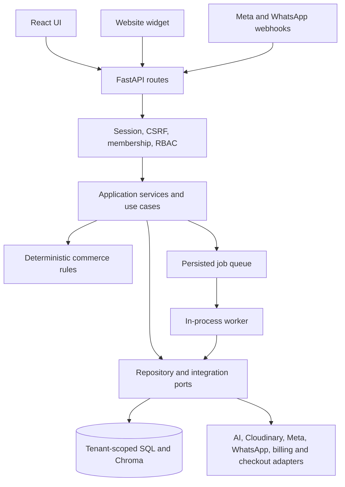
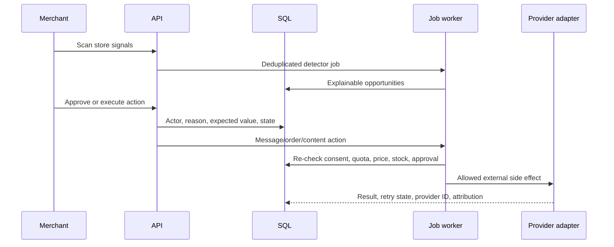

# Architecture

## Shape

This is a modular monolith: one deployable artifact, explicit module boundaries, and no internal network calls.

## Dependency rule

- `domain` imports no FastAPI, SQLAlchemy, Chroma, LangChain, or Meta code.
- `application` coordinates use cases and depends on repository/integration abstractions.
- `api` parses HTTP, authenticates, invokes a use case, and maps output.
- `repositories` make SQL the source of truth for tenant membership, price, stock, consent,
  approval, order, quota, automation, opportunity, and publication state.
- `integrations` contain replaceable external adapters.
- `container.py` is the only composition root selecting real, fake, or disabled implementations.

## Runtime modules

| Module | Responsibility |
| --- | --- |
| Conversations | Cross-channel customers, inbox threads, messages, notes, assignment, consent, and suggested replies. |
| Orders | Authoritative line items, totals, lifecycle transitions, timeline, checkout provider, and follow-up jobs. |
| Intelligence | Unified customer identity, RFM, lead score evidence, churn/probability, preferences, and segments. |
| Opportunities | Deterministic revenue detectors, priority, expected value, approvals, execution, and attribution. |
| Automations | Triggers, conditions, delays, approval gates, deduplication, retries, run history, and actions. |
| Content Studio | Brand profile, multi-format generation, factual validation, versions, campaigns, approval, schedule, and publish jobs. |
| Analytics/Billing | Tenant-scoped SQL metrics, usage ledger, subscriptions, plans, and organization-wide quota enforcement. |

## Revenue autopilot flow

## Sales flow

1. `AssistCustomerUseCase.execute()` asks the AI provider for a strict `CustomerNeed`.
2. Chroma retrieves product/policy identifiers only.
3. `ProductRepository` reloads current price, stock, status, and features.
4. Python removes inactive, out-of-stock, wrong-category, excluded, and over-budget items.
5. Python scores feature 50%, budget 25%, and use case 25%, with stable tie-breaking.
6. The provider renders only the final products/policies; a validator checks IDs, prices, stock, budget, and citations.
7. One regeneration is allowed; deterministic fallback ends the flow safely.

## Important failure points

| Failure | Behavior |
| --- | --- |
| Invalid image | HTTP 400 before storage/AI. |
| AI unavailable | Safe 502; no activation or fabricated output. |
| Content edited after approval | Approval fields cleared and status returns to draft. |
| Meta partial failure | Each result is saved; pack status becomes `partial`. |
| Repeated publish request | Existing result returned for the same key/platform. |
| Vector store stale price | SQL value wins before filtering or response generation. |
| Repeated webhook/event | Persisted provider/dedup key prevents duplicate effects. |
| Cross-store resource ID | Tenant-scoped lookup returns not found/forbidden. |
| Plan limit reached | Service rejects the operation with HTTP 402 before the side effect. |
| Worker/provider failure | Persisted retry with exponential backoff, then dead-letter state. |

## Scaling boundary

The verified local development topology uses SQLite, local Chroma, and an in-process consumer for
the SQL job queue. Production uses PostgreSQL-backed rate-limit buckets and SQL job leases, but
timely background execution still requires a persistent worker or higher-frequency scheduler. Add
platform/WAF rate limits and managed media/vector storage before high-volume horizontal scaling.
