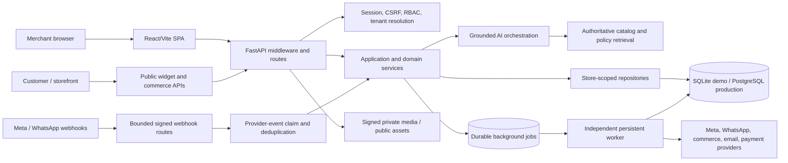

# Repository Truth Audit

Audit date: 2026-09-06 (Africa/Cairo)  
Canonical repository: `G:\Latest-Ai-Project\commerce-ai-mvp`  
Baseline commit: `f6f918a79ca4dd1aebe09df129b5755945955e89` (`main`)  
Audit scope: baseline plus the current uncommitted hardening candidate

## Executive conclusion

The repository is a real React/Vite and FastAPI application, not a static prototype. Its local deterministic mode now installs from lockfiles, generates fresh secrets, seeds SQLite, starts the API, frontend, and persistent worker, passes readiness, and supports browser login plus the two primary journeys. The codebase also contains production-shaped PostgreSQL migrations, encrypted provider connections, signed/deduplicated webhooks, a durable database job queue, privacy workflows, and live-provider adapters.

Those facts do **not** establish that production or any external provider is live for this candidate. This environment has no Git remote, deployment control-plane access, managed PostgreSQL verification URL, or real Meta/WhatsApp/OpenAI credentials. The historical public URL is reachable and its generic health endpoint reports healthy dependencies, but the formal deployment smoke fails because reserved API fallback and OpenAPI behavior identify an older build. All current-release live claims therefore remain unverified until credentialed acceptance evidence exists.

## Evidence policy

Evidence strength is ordered as follows:

1. Current source and schema constraints.
2. Automated tests that exercise the current source.
3. Fresh local runtime and browser evidence.
4. Credentialed provider or deployed-runtime evidence.
5. Documentation, which is treated as a claim until reconciled with the layers above.

An adapter, route, or historical document never upgrades a capability to “live verified” by itself.

## Architecture map



| Component                | Primary ownership                                                                                    | Important boundary                                                                                    |
| ------------------------ | ---------------------------------------------------------------------------------------------------- | ----------------------------------------------------------------------------------------------------- |
| Application composition  | `app/main.py`, `app/container.py`, `app/config.py`                                                   | Request limits, CORS, observability, production fail-closed configuration                             |
| Identity and tenancy     | `app/api/dependencies.py`, `app/services/auth_lifecycle.py`, `app/repositories/tenant_repository.py` | Signed cookie, server-side revocation, CSRF, role and active-store checks on every request            |
| API surface              | `app/api/routes/`, `app/api/router.py`                                                               | User, operator, public, OAuth, and webhook routes have different trust requirements                   |
| Domain/application logic | `app/application/`, `app/services/`, `app/domain/`                                                   | Grounding, approval, idempotency, inventory, privacy, and workflow invariants                         |
| Persistence              | `app/repositories/`, `app/db/`, `alembic/versions/`                                                  | Tenant keys, uniqueness constraints, transaction boundaries, PostgreSQL migration path                |
| Provider layer           | `app/integrations/`, `app/services/provider_connections.py`                                          | Encrypted per-store credentials and explicit demo/live modes                                          |
| Asynchronous execution   | `app/services/job_queue.py`, `app/services/job_handlers.py`, `scripts/worker.py`                     | Explicit complete handler registration, leases, retries, dead-letter state, deduplicated job creation |
| Frontend                 | `web/src/`, especially `web/src/lib/api.ts` and `web/src/features/`                                  | Real FastAPI calls through the Vite proxy; no provider secrets in browser code                        |
| Verification             | `tests/`, `web/src/**/*.test.*`, `scripts/verify_all.py`                                             | Unit/API/integration tests, browser evidence, and optional PostgreSQL release gate                    |

## Critical flows

### Sales journey

Customer message → signed provider webhook or isolated simulator → provider-event deduplication → conversation/message persistence → catalog and policy retrieval → deterministic business filters → structured AI response → citation and price/stock validation → merchant review → idempotent outbound queue → persistent worker → channel adapter → sent/failed state → audit events → refreshed inbox.

Local evidence: a seeded customer conversation produced a grounded recommendation with product citations, the browser sent it, the worker changed the message from queued to sent through the demo adapter, and the new audit contract records one human queue event and one system delivery event.

### Content journey

Product facts → content generation → factual validation → editable version → explicit human approval → approval snapshot hash → publish job carrying version/hash → worker revalidation → demo or live provider → published/failed state → audit events.

Local evidence: the browser generated a draft, approval created actor/time/hash evidence, publication was unavailable before approval, the worker published the approved version, and the audit table recorded separate `content_item.approved` and `content_item.published` events.

## Capability truth table

| Capability                                                      | Code exists |                                                                Test exists |          Demo verified |       Live verified | Blocker                                                                                                                                                                   |
| --------------------------------------------------------------- | ----------: | -------------------------------------------------------------------------: | ---------------------: | ------------------: | ------------------------------------------------------------------------------------------------------------------------------------------------------------------------- |
| Clean dependency/environment bootstrap                          |         Yes |                                                                        Yes |                    Yes |                 N/A | PostgreSQL is intentionally outside the SQLite demo path                                                                                                                  |
| Account login, sessions, CSRF, RBAC, tenant isolation           |         Yes |                                                                        Yes |                    Yes |          Unverified | No deployed-runtime access or merchant acceptance session                                                                                                                 |
| Unified inbox and inbound persistence                           |         Yes |                                                                        Yes |                    Yes |          Unverified | Real signed provider event not supplied in this environment                                                                                                               |
| Grounded sales suggestion with citations                        |         Yes | Yes, including eight adversarial vectors and hostile model-output fallback |                    Yes |          Unverified | No credentialed OpenAI acceptance; demo uses deterministic provider                                                                                                       |
| Idempotent outbound reply and delivery audit                    |         Yes |                                                                        Yes |                    Yes |          Unverified | Real provider retry/idempotency behavior still needs acceptance testing                                                                                                   |
| Content generation, edit invalidation, approval, publish, audit |         Yes |                                                                        Yes |                    Yes |          Unverified | Meta credentials/page/account and deployed worker unavailable                                                                                                             |
| Catalog, products, orders, inventory and opportunities          |         Yes |                                                                        Yes |              Partially |          Unverified | Full merchant acceptance script not yet executed in a deployed environment                                                                                                |
| Meta channels, OAuth, signed webhook and publishing adapters    |         Yes |                                                                        Yes |      Adapter/demo only |                  No | Real app credentials, redirect URL, account assets, webhook subscription, deployment                                                                                      |
| WhatsApp templates, signed webhook, inbox and send adapters     |         Yes |                                                                        Yes |      Adapter/demo only |                  No | Real WABA/phone credentials, public webhook, approved template, deployment                                                                                                |
| Shopify/WooCommerce/generic commerce connectors                 |         Yes |                                                                        Yes |                Partial |                  No | Credentialed stores and provider-specific acceptance evidence                                                                                                             |
| Durable job queue and independent worker                        |         Yes |                                                                        Yes |                    Yes |          Unverified | No production worker process or runtime telemetry access                                                                                                                  |
| Private media, retention, export and deletion                   |         Yes |                                                                        Yes |                    Yes |          Unverified | Production storage/provider and operational retention run not observed                                                                                                    |
| Production PostgreSQL migration head `20260902_0030`            |         Yes |                                                                        Yes | Local PostgreSQL 17.10 |                  No | Clean and `0024 → head` migrations plus representative `pg_dump`/`pg_restore` pass locally; managed-provider repetition against the immutable release remains unavailable |
| Deployment, health, logging and Sentry wiring                   |         Yes |                                                                        Yes |             Local only | Historical URL only | Public historical deployment is reachable but fails the candidate smoke contract; no Git remote, release SHA, or deployment control plane                                 |

## Fresh bootstrap and browser evidence

The following path was executed from a new local clone containing the current candidate and no `.env`:

```powershell
uv sync --all-groups --locked
npm --prefix web ci
uv run python -m scripts.verify_env_example
uv run python -m scripts.bootstrap_env
uv run python -m scripts.init_local
uv run uvicorn app.main:app --host 127.0.0.1 --port 8000
npm --prefix web run dev -- --host 127.0.0.1 --port 5173
uv run python -m scripts.worker
```

Observed results:

- Locked Python and npm installs completed; npm reported zero known vulnerabilities.
- The environment-template verifier passed before `.env` existed.
- Bootstrap generated fresh local secrets; no credential was copied from the working checkout.
- Initialization returned `status: ready` and seeded 24 products, 6 policies, and 3 conversations.
- `/health/live`, `/health/ready`, and the Vite root returned HTTP 200.
- A real browser loaded the Arabic landing page, logged in, reached the command center, opened the Inbox, sent a grounded reply, and completed the Content Studio approval/publication journey.
- The independent worker remained running and processed both outbound and publication jobs.
- Persisted sales evidence was `message.status=sent`, a succeeded `channel.send_message` job, and exactly one each of `outbound_message.queued` and `outbound_message.sent`.
- Persisted content evidence was `content_item.status=published`, matching approval actor/time/hash, a succeeded `content.publish` job, and exactly one each of `content_item.approved` and `content_item.published`.
- The broad UI verifier passed all 20 primary routes, Arabic/English directionality, public desktop/tablet/mobile breakpoints, theme/device states, the COD order lifecycle, and isolated loading, empty, network-unavailable, provider-disconnected, AI-unavailable, publish-failed, Home partial-source failure, feature-denied, and expired-session states with no unexpected accessibility, overflow, console, page, request or response errors.
- The dedicated `verify:journeys` browser gate passed against a fresh isolated checkout state and independent worker: the bilingual store and brand profiles saved, survived reload, and restored their original values; the Inbox reply used three citations and added exactly one sent message; Content Studio created one draft, saved a merchant edit, recorded approval, and reached published with no browser errors.
- The `commerce-ai-grounding-audit` gate passed the eight required attack classes. Exact or unknown
  identifiers no longer degrade into unrelated recommendations; ambiguous requests and missing
  policy evidence fail closed; fake discounts and prompt-control output trigger two validation
  attempts followed by deterministic grounded copy.
- A checksum-verified disposable PostgreSQL 17.10 cluster passed a clean migration through all 30
  revisions, an upgrade from `20260728_0024` to `20260902_0030`, and a real
  `pg_dump`/`pg_restore` drill covering migration version, two tenants, products, variants,
  inventory, COD orders/items, jobs, counts, totals, and cross-tenant joins. This is local
  migration/restore evidence, not managed-provider or production-backup proof.

This evidence proves the isolated local demo only.

## P0 defects repaired during the audit

| Defect                                                                                                                                              | Risk                                                                                                                                 | Current control and regression evidence                                                                                                                                                                                                                                |
| --------------------------------------------------------------------------------------------------------------------------------------------------- | ------------------------------------------------------------------------------------------------------------------------------------ | ---------------------------------------------------------------------------------------------------------------------------------------------------------------------------------------------------------------------------------------------------------------------- |
| `.env.example` was re-ignored by a duplicate `.env*` rule                                                                                           | A clean checkout could not bootstrap                                                                                                 | Ignore rule removed; `scripts/verify_env_example.py` checks Git visibility; unit regression added                                                                                                                                                                      |
| Direct `Settings(...)` construction implicitly loaded the developer `.env`                                                                          | Tests and tools could inherit unrelated local state                                                                                  | `.env` loading moved to `get_settings()`; constructor-isolation regression added                                                                                                                                                                                       |
| Inbox reply retries had no client idempotency contract                                                                                              | Duplicate customer messages                                                                                                          | Required `Idempotency-Key`, unique `(conversation_id, client_request_id)`, same-payload replay and conflicting-payload rejection tests                                                                                                                                 |
| Content publish implicitly approved drafts and approval had no immutable evidence                                                                   | Unauthorized or stale content publication                                                                                            | Explicit approval only, actor/time/hash evidence, edit invalidation, worker version/hash revalidation, legacy-row reset migration, tamper tests                                                                                                                        |
| Local private media lived under a broadly mounted static upload directory                                                                           | Unauthenticated customer-media disclosure                                                                                            | Public route now serves only direct public filenames; signed private route remains; bypass regression returns 404                                                                                                                                                      |
| Sales query “audit” stored raw customer and reply text and outlived message retention                                                               | PII retention beyond stated policy                                                                                                   | Only SHA-256 digests plus structured non-PII fields persist; store deletion and retention remove rows; privacy regressions added                                                                                                                                       |
| Sales citations were hidden and outbound replies lacked an audit trail                                                                              | Weak merchant evidence and accountability                                                                                            | Inbox renders citation IDs; queue and delivery create actor-scoped audit events; focused backend/frontend regressions added                                                                                                                                            |
| The standalone worker imported only a subset of decorated job-handler modules                                                                       | Queued outbound and other jobs could retry and dead-letter with no registered handler                                                | Central worker handler registry imports and asserts every durable job type; unit regression plus browser-created outbound and content jobs completed through the independent worker                                                                                    |
| Handoff manifest embedded an absolute path, hashed platform line endings, and counted ignored seed images                                           | A relocated or Windows checkout could fail validation or omit required catalog assets                                                | Repository-relative root, canonical text fingerprints, relocation/CRLF regression, and Git-visible placeholder assets; clean-checkout verifier passes                                                                                                                  |
| Broad UI verifier used an ambiguous password label and captured responsive screenshots before render                                                | False verifier failures and loading-state evidence                                                                                   | Password input selector is exact; tablet/mobile landing headings are awaited; full verifier now passes with production-sized screenshots                                                                                                                               |
| Provider success followed by worker termination could trigger the same external side effect on retry                                                | Duplicate customer reply or social publication                                                                                       | Durable `external_operations` attempt is committed before the provider call; unfinished calls become audited `delivery_unknown` / `publish_unknown` states and do not invoke the provider again; crash-window, transport, success and explicit-retry regressions added |
| Ambiguous or identifier-constrained sales questions could fall back to unrelated catalog items, and missing policy evidence still reached the model | Arbitrary recommendations or invented commerce terms                                                                                 | Explicit identifiers are hard constraints, unconstrained ambiguity returns insufficient context, missing evidence bypasses the model, and the versioned adversarial corpus covers all eight required attack classes                                                    |
| Valid-schema model output could contain fake discounts or echoed prompt-control language                                                            | Customer-facing hallucination despite schema validation                                                                              | Reply validator rejects unsupported discount/scarcity, absolute and prompt-control claims; retry feedback is followed by deterministic grounded fallback                                                                                                               |
| PostgreSQL migration verification inherited demo `.env` values and encoded its schema in a URL that Alembic could not parse or honor                | Release migrations failed before execution or targeted `public` instead of disposable schemas                                        | Migration subprocesses override demo-only settings; Alembic accepts only `public` or generated verifier schema names, escapes percent-encoded URLs, and clean/upgrade runs pass on PostgreSQL 17.10                                                                    |
| Backup/restore tenant validation used an unescaped SQL `%` with Psycopg                                                                             | The restore completed but its validation gate crashed                                                                                | Query uses PostgreSQL `chr(37)`; the real `pg_dump`/`pg_restore` commerce drill passes                                                                                                                                                                                 |
| Authenticated API `401` responses did not expire shared frontend auth state, and route guards silently sent unauthorized users Home                 | Merchants could remain in a broken shell or receive no explanation for denied access                                                 | Non-public `401` responses emit one global session-expiry signal; the auth provider clears access state; login shows a localized expiry notice; feature/operator guards render a localized denial with a Home action; unit and browser regressions pass                |
| Handoff filtering treated any credential-named source and the whole `data/` tree as disposable                                                      | A source-only checkout omitted `credential_vault.py`, tests, seed inputs, and even the SQLite parent directory, so clean boot failed | Selection now excludes only plural credential export files and runtime data while retaining source/tests plus `data/seeds/**`; focused regressions and a fresh manifest-only boot pass                                                                                 |
| Core browser assertions depended on whichever sent message or rendered status happened to be visible first                                          | Seeded records and worker/UI timing produced nondeterministic false failures                                                         | The verifier records pre-action server state, polls the exact conversation/content entity to its terminal status, reloads once, and then asserts that exact state in the UI                                                                                            |
| Home prioritized opportunity/analytics modules and the shell displayed fixed notification claims without an API source                              | P0 work was obscured and merchants could mistake fabricated sample events for real store outcomes                                    | Home now derives reply, content, publishing, connection, order, and response-time state from typed APIs with per-source isolation; English/Arabic and browser regressions pass; the unbacked notification surface is removed                                           |
| Store and brand profile forms retained Arabic labels after switching the workspace to English, and their UI save paths lacked browser persistence proof | English-speaking merchants could not reliably configure a P0 profile and API-only tests overstated UI readiness                    | Centralized complete Arabic/English profile copy plus unit regressions; the fresh browser journey saves each profile, reloads persisted values, and restores the original data through the real API                                                                   |
| Desktop and mobile navigation promoted non-P0 modules alongside the merchant's core jobs                                                            | The first merchant workflow was visually overwhelmed despite all routes being functional                                              | Six P0 desktop links are primary; secondary modules remain accessible through a disclosure/drawer/command palette; mobile prioritizes four P0 links plus More; unit and full browser regressions pass                                                                  |
| Required failure states were not all browser-proven, publication failures exposed raw status codes, and English Integrations mixed Arabic-only panels | Merchants could receive ambiguous recovery guidance or an inconsistent localized workflow                                            | Localized actionable publication states and bilingual Meta/commerce/WhatsApp/template panels added; the isolated browser matrix now proves every required failure state and compact mobile layout without provider mutations                                            |

## Documentation and artifact contradictions found

- Obsolete drive-specific handoff/test commands were replaced with path-relative commands.
- Incompatible copied test counts were removed from current docs in favor of dated command evidence.
- Several artifacts still name migration `20260729_0028`; that is historical deployment evidence, not the current candidate head `20260902_0030`.
- Deployment documents make stronger claims than can be independently verified from this environment. Historical claims must be labelled as historical, and current live status as unverified.
- The reusable plaintext demo password was removed from the Arabic guide and demo script; both now require the one-time password generated by `scripts.bootstrap_env`.
- The deterministic handoff manifest is regenerated after candidate changes and independently validates in a relocated source-only checkout.

## Open blockers and risks

1. **Production acceptance:** no Git remote, immutable release SHA, deployment access, managed PostgreSQL verification URL, external worker evidence, or merchant sign-off is available.
2. **External providers:** no real Meta, WhatsApp, OpenAI, commerce-store, email, or payment credentials were supplied. Adapter tests are not live proof.
3. **Managed migration/restore acceptance:** clean/upgrade migrations and a representative logical
   restore pass on local PostgreSQL 17.10, but they must be repeated against the immutable release
   on approved managed PostgreSQL and a real provider backup restored to a separate destination.
4. **Provider reconciliation acceptance:** the local candidate stops rather than blindly retrying an unfinished provider call, but each real provider and operator workflow must confirm how an unknown attempt is inspected and resolved.
5. **Live AI adversarial acceptance:** the deterministic eight-vector corpus and injected hostile
   structured outputs pass locally, but the same corpus has not run against a credentialed OpenAI
   model/provider and therefore is not live acceptance evidence.
6. **Independent review:** attempted parallel audit/review agents were unavailable because the account’s subagent usage limit was reached. This is a review-coverage gap, not evidence of a code defect.

## Phase 0 disposition

Repository orientation, source/test/runtime reconciliation, clean local boot, the two primary local journeys, P0 repair work, and threat modeling are complete for the local candidate. Production activation and live-provider verification remain explicitly gated and must not be represented as complete.
