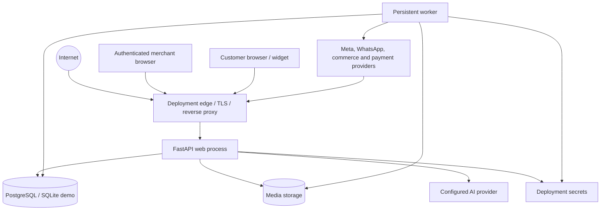

# Commerce Revenue Autopilot Threat Model

Status: current local hardening candidate  
Model date: 2026-09-01  
Baseline: `f6f918a79ca4dd1aebe09df129b5755945955e89` plus the working-tree changes described in `docs/REPOSITORY_TRUTH_AUDIT.md`

## 1. Scope and method

This model covers the React/Vite merchant frontend, FastAPI application, authentication and tenant boundary, SQLAlchemy/PostgreSQL persistence, SQLite demo mode, durable worker, AI grounding layer, public widget, media delivery, commerce connectors, Meta and WhatsApp webhooks, provider credential storage, content publishing, and privacy operations.

It is based on source inspection, automated tests, a clean local bootstrap, browser execution of the sales and content journeys, and direct inspection of local persisted state. It does not claim a production penetration test, cloud-configuration review, credentialed provider test, or deployed network assessment.

An independent reviewer was requested as part of the threat-model workflow, but all available subagent attempts failed because the account’s subagent usage limit was reached. The absence of that review is recorded as an assurance gap.

## 2. System and trust boundaries

### Trust boundaries

| Boundary | Untrusted input or privilege transition | Primary controls |
|---|---|---|
| Browser → API | Cookies, CSRF header, form data, uploads, route identifiers | Signed session claims, server-side session validation, double-submit CSRF, RBAC, tenant resolution, request/body limits |
| Customer/widget → public API | Consent state, chat text, catalog query, browser event payload | Public-route rate limits, bounded payloads, consent-aware persistence, authoritative catalog retrieval |
| Provider → webhook | Raw JSON, signatures, event IDs, message/media content | Bounded body, HMAC signature, constant-time compare, provider event uniqueness, tenant-bound channel lookup |
| API/worker → database | Store and organization identifiers, approval state, job leases | Store-scoped repositories, foreign keys/uniqueness, transactions, approval hashes, job lease tokens |
| API/worker → external providers | Customer-facing replies, content, credentials, URLs | Encrypted per-store credentials, explicit demo/live modes, approval gates, HTTPS/SSRF controls, provider timeouts |
| Customer text → AI | Prompt injection, false product facts, policy manipulation | Structured outputs, prompt guard, authoritative filters/ranking, citation validation, deterministic fallback |
| Private media → browser | Guessed paths, forged/expired tokens, path traversal | Signed resource tokens, exact filename checks, non-public storage paths, private no-store responses |
| Deployment operator → privileged routes/jobs | Operator email, cron/release bearer token, environment secrets | Server-side allowlist, constant-time token verification, production configuration validation |

## 3. Assets and security objectives

| Asset | Confidentiality | Integrity | Availability |
|---|---:|---:|---:|
| Provider/OAuth credentials and encryption keys | Critical | Critical | High |
| Authentication sessions, password hashes, MFA seeds and recovery state | Critical | Critical | High |
| Merchant/customer PII, conversations, orders and private media | Critical | High | High |
| Tenant membership, roles and active-store context | High | Critical | High |
| Catalog price, stock, policy and inventory ledger | Medium | Critical | High |
| Human approvals, approval hashes and audit events | Medium | Critical | High |
| Outbound replies, publications and provider result state | Medium | Critical | High |
| Durable jobs, leases, retries and dead-letter state | Low | High | Critical |
| AI budgets, usage records and grounding citations | Medium | High | Medium |

## 4. Attacker model

In-scope attackers include:

- An unauthenticated internet user targeting public routes, webhooks, login, media URLs, or denial of service.
- An authenticated member trying to exceed their role or cross into another store/organization.
- A malicious customer embedding prompt injection, false prices, unsafe links, or oversized/replayed events in messages.
- An attacker holding a leaked provider token, webhook secret, session cookie, database dump, or deployment secret.
- A compromised or unreliable provider that returns ambiguous results or succeeds immediately before a worker failure.
- An insider with legitimate merchant access attempting unapproved publication or privacy-policy bypass.

The model does not assume application-level controls can survive full compromise of the application host, database administrator, and deployment secret store at the same time.

## 5. Existing controls with source evidence

- Sessions are signed, but every request also validates the server-side session and resolves active membership/store access; state changes require CSRF and minimum roles (`app/api/dependencies.py:49`, `app/api/dependencies.py:67`, `app/repositories/tenant_repository.py:90`, `app/services/auth_lifecycle.py:152`). Session cookies are HttpOnly and production cookies are required to be secure (`app/api/routes/auth.py:125`, `app/config.py:249`).
- Production configuration rejects demo mode, insecure origins, non-HTTPS public URLs, non-PostgreSQL databases, and PostgreSQL without TLS (`app/config.py:222`). Production-readiness checks flag a missing dedicated integration-encryption key (`app/config.py:268`, `app/config.py:306`).
- Per-store provider credentials use Fernet authenticated encryption and a versioned rotation keyring (`app/services/credential_vault.py:24`, `app/services/credential_vault.py:37`, `app/repositories/provider_connection_repository.py:67`).
- Meta and WhatsApp webhook bodies are bounded, HMAC verified with constant-time comparison, and claimed under unique external event IDs (`app/api/routes/meta_channels.py:176`, `app/services/meta_channels.py:240`, `app/services/meta_channels.py:248`, `app/api/routes/whatsapp.py:438`, `app/services/whatsapp.py:421`, `app/services/whatsapp.py:480`).
- Commerce origins must be public HTTPS, all resolved addresses must be global, redirects and environment proxies are disabled, and requests pin the validated IP while preserving SNI/Host (`app/integrations/commerce_modules/common.py:48`, `app/integrations/commerce_modules/common.py:76`, `app/integrations/commerce_modules/common.py:95`).
- Sales recommendations apply authoritative stock/budget/category filters, validate citations and prices, and fall back deterministically if live AI output is invalid (`app/domain/ranking.py:43`, `app/domain/validators.py:177`, `app/services/sales_assistant.py:26`). The live adapter uses structured JSON-schema output and an explicit untrusted-data guard (`app/integrations/ai_provider.py:335`, `app/integrations/ai_provider.py:347`).
- Content approval captures actor, time, version, and a stable content hash; edits invalidate evidence and workers revalidate the queued version/hash before publishing (`app/services/content_studio.py:139`, `app/services/content_studio.py:344`, `app/services/content_studio.py:523`).
- Outbound inbox replies require client idempotency, persist a unique request key per conversation, reject conflicting reuse, and emit separate queue/delivery audit events (`app/api/routes/inbox.py:78`, `app/db/model_groups/customers.py:121`, `app/services/conversations.py:374`, `app/services/conversations.py:448`, `app/services/conversations.py:545`).
- Local customer media is written to a private directory and served only through signed tokens; the public upload route rejects nested paths (`app/integrations/image_storage.py:64`, `app/main.py:257`, `app/main.py:311`).
- Raw sales queries and replies are not retained in the query audit table; only SHA-256 digests and structured fields remain, and message-window retention deletes those rows (`app/repositories/sales_repository.py:18`, `app/services/privacy.py:701`).
- The job queue uses deduplicated creation, row locking, leases, heartbeats, retries and dead-letter behavior (`app/services/job_queue.py:58`, `app/services/job_queue.py:89`, `app/services/job_queue.py:229`, `app/services/job_queue.py:331`).
- Provider-bound message and content jobs commit a unique attempt to `external_operations` before the network call. An unfinished attempt is moved to an operator-visible reconciliation state rather than automatically invoked again (`app/services/external_operations.py`, `app/services/conversations.py:485`, `app/services/content_studio.py:517`).
- Sentry is configured without default PII, and request completion logging records method/path/status rather than request bodies (`app/main.py:74`, `app/main.py:202`).

## 6. Prioritized threat scenarios

Severity calibration: **Critical** permits cross-tenant compromise, provider credential theft, or arbitrary external financial/customer action; **High** exposes sensitive PII or bypasses approval/authentication; **Medium** causes material single-tenant integrity/availability loss; **Low** has constrained impact or requires strong preconditions.

| ID | Scenario and attack path | Impact | Likelihood | Current controls | Residual status / required action |
|---|---|---:|---:|---|---|
| TM-01 | Authenticated user changes a route/store identifier to read or mutate another tenant | Critical | Low | DB-backed session, active membership/store join, store-scoped repositories, RBAC, isolation tests | Controlled in inspected paths; retain negative tenant tests for every new repository/API |
| TM-02 | Stolen session cookie or cross-site request performs merchant actions | High | Low–Medium | HttpOnly/Secure production cookie, same-site policy, server revocation, double-submit CSRF, short-lived signed claims | Validate deployed cookie/HTTPS behavior and session revocation in production acceptance |
| TM-03 | Forged or replayed Meta/WhatsApp webhook creates messages, changes delivery state, or drives automations | High | Low | HMAC verification, bounded raw body, channel-bound credentials, unique provider-event claim | Credentialed public-webhook test remains required; rotate secrets on suspected exposure |
| TM-04 | Database disclosure reveals provider credentials or one tenant decrypts another tenant’s connection | Critical | Low–Medium | Fernet encryption, store-scoped lookup, key versioning/rotation | Require a dedicated `INTEGRATION_ENCRYPTION_KEY` in production operations, protect old keys, and test rotation; database plus key compromise remains catastrophic |
| TM-05 | Merchant-supplied commerce URL targets loopback, link-local, cloud metadata, or DNS rebinding | Critical | Low | Public-HTTPS validation, all-IP global check, IP pinning, SNI/Host preservation, redirects/proxies disabled | Add deployment-network egress policy as defense in depth; keep rebinding and IPv6 tests |
| TM-06 | Guessed static path exposes customer-uploaded media without authorization | High | Low after fix | Private subdirectory, signed store/filename token, exact filename check, no-store cache, regression test | Repaired in current candidate; production must use database/cloud storage because local media is flagged unready |
| TM-07 | Marketer publishes an unapproved or edited-after-approval content version | High | Low after fix | Explicit approval endpoint, actor/time/hash evidence, edit invalidation, worker hash/version check, audit events | Repaired in current candidate; migration resets legacy approved/scheduled Studio rows lacking evidence |
| TM-08 | Retry, double-click, or network ambiguity sends the same customer reply twice | High | Low locally | Required client key, database uniqueness, replay comparison, job dedup | Local/API contract repaired; template/media endpoints and real provider semantics still need equivalent acceptance review |
| TM-09 | Provider accepts an outbound operation, worker crashes before local commit, retry sends it again | High | Low after fix | Durable pre-call operation/attempt record, explicit retryable-failure state, `delivery_unknown` / `publish_unknown` reconciliation states, audit events, and UI warning prevent blind retry after an unfinished call | Locally mitigated. Credentialed acceptance must confirm provider IDs/reconciliation procedures; the safe failure mode can delay or miss an operation pending human review rather than risk a duplicate |
| TM-10 | Customer prompt injection makes AI invent a product, price, discount, policy, or unsafe instruction | High | Medium | Untrusted-data guard, structured output, authoritative filters, citation and price/stock validation, deterministic fallback | Expand adversarial corpus and run against the exact production model; never let model output mutate catalog/approval state directly |
| TM-11 | Raw messages, provider errors, or secrets leak through database “audit” fields, logs, Sentry, or support artifacts | High | Medium | Sales text hashing, retention/deletion, `send_default_pii=False`, request-body exclusion, common-key redaction | Test exceptional paths with canary secrets; avoid raw provider response bodies in errors; centralize structured allowlist logging |
| TM-12 | Public endpoints, authentication, webhooks, uploads, or job creation exhaust web/worker/database capacity | Medium–High | Medium | Request size limits, rate limits, bounded webhooks/uploads, durable queue limits/retries | Confirm trusted proxy/IP configuration, provider webhook burst capacity, queue alerting and database connection limits in deployment |
| TM-13 | Compromised approval/audit actor or direct database write hides who authorized external content/action | High | Low | Server-resolved actor identity, immutable approval snapshot, append-style audit events | Database administrators remain trusted; export audit logs to tamper-evident external storage for stronger non-repudiation |
| TM-14 | Private customer text survives stated retention in auxiliary AI/query tables | High | Low after fix | Query table stores digests only; retention and store deletion remove rows | Repaired in current candidate; verify every future AI telemetry table is included in retention/export/deletion mapping |

## 7. Security assumptions and verification gaps

- TLS termination, DNS, deployment routing, and the secret store are assumed trustworthy; they were not inspectable here.
- The reverse proxy is assumed to provide a meaningful client address. Current rate limiting uses the application-observed peer; a misconfigured proxy could collapse many users into one bucket or reduce attribution quality.
- Managed PostgreSQL must enforce TLS and least-privilege credentials. Only the SQLite demo was runtime-verified here.
- The worker must run as an independent persistent process. In-process/background-thread behavior is not an acceptable production substitute.
- No current live-provider credentials, real customer data, or production database were inspected.
- TOTP validation does not appear to persist a last-used time step, so replay within the same validity window remains a low-priority hypothesis to test.
- Log redaction is pattern/key based. Unlabelled secret-shaped values inside arbitrary exception strings require explicit canary testing.

## 8. Required security gates before a live claim

1. Run clean and upgrade-path migration tests plus backup/restore against disposable managed PostgreSQL with TLS.
2. Deploy an immutable release SHA with separate web and worker processes, dedicated integration-encryption key, secure cookies, trusted HTTPS origins, and verified readiness/telemetry.
3. Execute real Meta and WhatsApp signed inbound → persisted inbox → grounded suggestion → human approval → outbound provider result journeys; retain provider IDs and audit evidence without retaining message text in verification artifacts.
4. Validate the TM-09 reconciliation policy with each live provider, retain provider IDs where returned, and train operators not to resend an unknown outcome before checking the channel.
5. Run the adversarial AI grounding suite against the exact production provider/model and confirm cost/quota/circuit-breaker behavior.
6. Exercise privacy export, retention, deletion, private media, session revocation, operator access, and incident/credential-rotation procedures in the deployed environment.
7. Obtain an independent security review because the planned reviewer pass could not run in this session.

## 9. Reassessment triggers

Update this model when adding a provider, changing authentication/session storage, introducing a new public endpoint or upload type, changing deployment topology, moving media storage, altering tenant keys, changing the AI model/tool permissions, changing worker retry semantics, or adding any path that sends customer-facing content without the existing approval and audit contracts.

Repository: target_sha256_ae8939a31e820d32422b4a08473679639b240e0cf11573219e3e761dd01fa70f
Version: codex-security-snapshot/v1:sha256:24f05fa6accc3cd7e5cf535eccd1f4bf61d9b587a8db2a47d2b8c734d962c7eb
